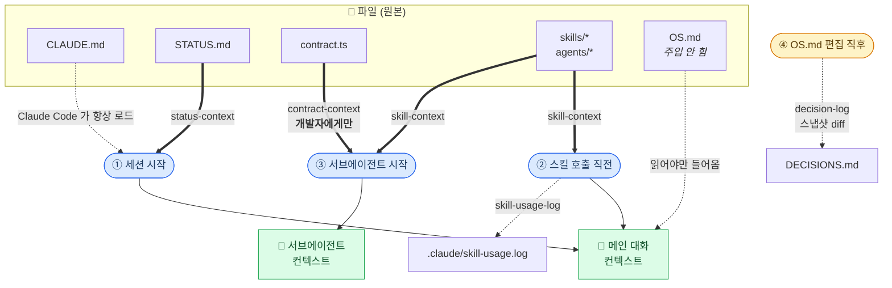

# 2주차 — 컨텍스트 설계

> 이 문서는 **"Claude 가 무엇을, 언제 보게 되는가"** 를 다룬다.
> 코드가 아니라 **컨텍스트**가 주제다. 실제 훅 구현은 [`README.md`](../README.md)의 OS 구성 절을,
> 서비스 청사진은 [`OS.md`](../OS.md)를 본다.

## 도식 — 무엇이 언제 들어오는가

네 개의 **시점(이벤트)** 이 있고, 각 시점마다 훅이 붙어 컨텍스트를 넣거나 기록을 남긴다.



**굵은 화살표(⇒)는 주입**, 점선은 기록이거나 수동이다.
`OS.md` 는 315줄로 커서 어디에도 주입하지 않고, `CLAUDE.md` 가 이정표로만 가리킨다.

### 서브에이전트는 누구냐에 따라 다르게 받는다

```
                     ┌─ skill-context ──→ 스킬·에이전트 카탈로그
  서브에이전트 시작 ─┤
                     └─ contract-context ─→ agent_type 을 본다
                                              ├─ backend-developer  → 계약 전문 ✅
                                              ├─ frontend-developer → 계약 전문 ✅
                                              └─ product-planner    → 안 줌 ❌
                                                 (상위 의사결정만 하므로 타입 불필요)
```

---

## 한눈에

컨텍스트와 관련된 파일은 23개다. 하지만 **전부가 컨텍스트로 들어가지는 않는다.**
중요한 건 개수가 아니라 **"언제 들어오느냐"** 다.

| 분류 | 개수 | 언제 들어오나 |
|---|---|---|
| 항상 | 1 | 모든 세션·모든 서브에이전트 |
| 조건부 자동 | 11 | 세션 시작 / 스킬 호출 / 서브에이전트 시작 |
| 수동 (읽어야 들어옴) | 5 | 필요할 때 직접 읽음 |
| 기계 (주입 안 됨) | 6 | 컨텍스트를 *넣는* 쪽 |

---

## 1. 항상 들어오는 것 — 1개

**`CLAUDE.md`** — Claude Code 가 **자동으로 로드하는 유일한 슬롯**이다. 그래서 여기에는
*항상 참인 사실*과 *어디를 더 볼지 이정표*만 담는다. 세부는 `OS.md` 로 넘긴다.

> **여기 거짓이 있으면 가장 비싸다.** 매 세션, 모든 서브에이전트가 그 거짓을 믿고 출발한다.
> 실제로 이번 주차에 `CLAUDE.md` 의 실행 명령이 하나도 동작하지 않는 상태였다
> (`node_modules`·`dev.db`·`.env` 부재). 그걸 고치는 것이 컨텍스트를 더 넣는 것보다 급했다.

## 2. 조건이 맞으면 자동으로 들어오는 것 — 11개

| 무엇 | 언제 | 넣는 훅 |
|---|---|---|
| `STATUS.md` | 세션 시작 | `status-context` |
| `src/types/contract.ts` | 개발자 에이전트 시작 | `contract-context` |
| 스킬 6 + 에이전트 3 의 목록 | 스킬 호출 직전 · 서브에이전트 시작 | `skill-context` |

마지막 9개는 파일 맨 위 두 줄(`name`, `description`)만 뽑아 **목록**으로 만든다.
본문 전체가 들어가는 건 그 스킬을 실제로 호출할 때다.

## 3. 읽어야만 들어오는 것 — 5개

| 파일 | 왜 자동이 아닌가 |
|---|---|
| `OS.md` (315줄) | 너무 크다. `CLAUDE.md` 가 이정표로만 가리킨다 |
| `README.md` | OS 구성 상세. 필요할 때만 |
| `DECISIONS.md` | 기획 결정 전에만 |
| `docs/context.md` (이 문서) | 컨텍스트 설계를 되짚을 때만 |
| `.claude/skills/interview/PHILOSOPHY.md` | 그 스킬을 쓸 때만 |

**모든 걸 넣는 게 좋은 게 아니다.** 컨텍스트에는 예산이 있고, `OS.md` 315줄을 매번 넣으면
정작 중요한 것이 묻힌다. 그래서 "작고 자주 변하는 것"(`STATUS.md`)은 넣고,
"크고 잘 안 변하는 것"(`OS.md`)은 가리키기만 한다.

## 4. 컨텍스트가 아니라 기계 — 6개

훅 5개(`.claude/hooks/*.sh`)와 `.claude/settings.json`.
컨텍스트에 들어가지 않고, **컨텍스트를 넣는 쪽**이다.

## 5. 부산물 — git 제외

`.claude/.os-snapshot.md` · `.claude/skill-usage.log` · `.claude/*.err`

---

## 훅 6개 — 무엇을 하나

훅은 두 가지 일을 한다. **(A) 필요한 것을 알아서 넣어주기**, **(B) 벌어진 일을 알아서 남기기.**

| 훅 | 언제 | 종류 | 하는 일 | 왜 필요했나 |
|---|---|---|---|---|
| `status-context` | 세션 시작 | A | `STATUS.md` 전문 주입 | CLAUDE.md 가 "먼저 읽어라"고 *부탁*만 했다. 이제 *보장*이다 |
| `skill-context` | 스킬 호출 직전 · 서브에이전트 시작 | A | 스킬·에이전트 카탈로그를 파일에서 실시간 생성 | 손으로 적은 목록은 반드시 실제와 어긋난다 |
| `contract-context` | 서브에이전트 시작 | A | 공유 계약 전문 주입. **개발자 둘에게만** | "단일 진실 출처"라 선언해놓고 정작 개발 에이전트는 못 보고 시작했다 |
| `skill-usage-log` | 스킬 호출 직전 | B | `시각<TAB>스킬이름` 한 줄 append | `skill-stat` 이 볼 데이터가 아예 없었다 |
| `decision-log` | `OS.md` 편집 직후 | B | 바뀐 **절 이름**을 `DECISIONS.md` 에 기록 | 기존 기록은 절을 몰라 정보가 없었다 |
| `loop-map-context` | 루프 구성 파일(훅·스킬·settings·CI) 편집 직후 | A | "루프 지도(`docs/dev-loop-map.html`)를 갱신·재발행하라"는 컨텍스트 주입 | 루프는 바뀌는데 지도는 사람이 기억해야만 갱신됐다. 감지는 기계가, 의미 해석·갱신은 모델이 맡는 분업. 지도 자신의 편집은 무시(무한 메아리 방지) |

### 부탁 vs 보장

이 주차의 핵심 교훈이다.

`CLAUDE.md` 에 "작업 시작 시 `STATUS.md` 를 먼저 확인하라"고 적어두는 것은 **부탁**이다.
모델이 읽기로 선택해야만 읽힌다. 반면 SessionStart 훅으로 넣으면 **보장**이다.

문서에 규칙을 적는 것과, 그 규칙이 지켜지도록 장치를 만드는 것은 다르다.

### 왜 `product-planner` 에겐 계약을 안 주나

`contract-context` 는 `agent_type` 을 보고 `backend-developer` / `frontend-developer` 에만 계약을 넣는다.
기획자는 상위 의사결정만 하므로 타입 207줄이 필요 없다. **컨텍스트는 필요한 사람에게만 준다.**

---

## A/B 테스트 — 계약 주입은 실제로 값을 하는가

`contract-context` 훅이 정말 필요한지 실측했다. 훅을 켠 채 / 끈 채로 **같은 질문**을 던지고 비교했다.

### 설계

- **대상**: `frontend-developer` 서브에이전트, 각 조 2회
- **질문 4개** (전부 `contract.ts` 주석에만 답이 있음)
  1. 마감임박순 정렬에서 `deadline`이 `null`인 공고는 어디에?
  2. `description`이 `null`일 때 프론트가 1급 요소로 삼을 것은?
  3. `JobDTO.bookmark` 의 정확한 타입 표기는?
  4. `DEV_ROLE_OPTIONS.code` 를 프론트가 그대로 써도 되는가?
- **양쪽 모두 도구 사용 허용** (읽고 싶으면 읽어도 된다)
- 대조군은 훅 스크립트에 임시 스위치를 넣어 주입만 껐다. 나머지 조건은 동일.

### 결과

| 조 | 계약 주입 | 도구 호출 | 토큰 | 시간 | 정답 |
|---|---|---|---|---|---|
| A-1 | 훅 | 0 | 16,487 | 18.5s | 4/4 |
| A-2 | 훅 | 0 | 16,487 | 22.2s | 4/4 |
| C-1 | 없음 | **2** | 19,087 | 25.6s | 4/4 |
| C-2 | 없음 | **2** | 18,644 | 24.0s | 4/4 |
| **평균 A** | 훅 | **0.0** | **16,487** | **20.4s** | 4/4 |
| **평균 C** | 없음 | **2.0** | **18,866** | **24.8s** | 4/4 |
| 차이 | | +2.0 | +2,379 (+14%) | +4.4s (+22%) | 동일 |

### 해석

**정답률은 같다.** 주입이 없어도 에이전트는 `contract.ts` 와 `OS.md` 를 찾아 읽어서 정확히 답했다.
즉 **주입은 정확도를 만들어내는 장치가 아니다.**

**대신 비용을 줄인다.** 대조군은 매번 파일을 2번 찾아 읽었고, 토큰 14%·시간 22% 를 더 썼다.
서브에이전트를 부를 때마다 반복되는 비용이다.

**그리고 안전망이 된다.** 대조군이 답을 맞힌 건 "성실하게 찾아봤기 때문"이다.
바쁘거나 프롬프트가 급하면 찾지 않고 추측할 수도 있다. 주입은 그 여지를 없앤다.
`deadline: null` 을 맨 뒤로 보내야 한다는 규약은 **타입만 봐서는 알 수 없고 주석에만 있다.**

> **같은 것을 두 번 넣지 말 것.**
> 훅으로 주입된 상태에서 프롬프트에 계약을 한 번 더 붙여봤더니
> 토큰만 1,371 늘고(16,487 → 17,858) 정답·도구 호출은 그대로였다.

### 이 실험에서 실제로 배운 것

첫 시도는 **실패했다.** 대조군에게 계약을 안 줬는데도 도구 없이 4문항을 다 맞혔고,
주석을 **글자 그대로** 인용했다. 지어낼 수 없는 문장이었다.

원인은 `contract-context` 훅이 **이미 살아서 대조군에게도 계약을 주입하고 있었기** 때문이다.
`settings.json` 은 세션 시작 때 읽히니 새 훅은 다음 세션부터라고 믿었는데, 틀렸다.

확인 방법은 훅 스크립트에 표식 한 줄을 넣고 에이전트를 하나 띄워 본 것이다.

```
08:03:39Z FIRED payload=421B      ← 훅이 실제로 발동했다
```

그래서 실험을 다시 설계했다. **"주지 않았다"고 믿는 것과 "실제로 안 갔다"를 확인하는 것은 다르다.**

---

## 설계 원칙 3가지

이번 주차에 반복해서 부딪힌 것들이다. 새 훅을 만들 때 지킨다.

### 1. `jq` 를 쓰지 않는다

이 환경에 `jq` 가 없다. 죽어 있던 훅 두 개(`decision-log`, `skill-usage-log`)가 **둘 다 이것 때문**이었다.
payload 는 `sed` 로 뽑는다. `"file_path"` 와 `"skill"` 은 payload 에 각각 정확히 한 번만 등장하므로 안전하다
(`tool_response` 는 `filePath` 처럼 camelCase 라 겹치지 않는다).

### 2. 조용히 실패하지 않는다

`decision-log` 는 `jq` 가 없어 경로를 못 읽고 **조용히 `exit 0`** 했다. 실패 신호가 어디에도 안 남아
2026-07-05 이후 몇 달간 죽은 줄 아무도 몰랐다.

이제 파싱에 실패하면 `.claude/*.err` 에 흔적을 남긴다.
훅은 작업을 막으면 안 되므로 여전히 `exit 0` 하지만, **말없이 사라지지는 않는다.**

### 3. payload 를 추측하지 않는다

훅이 무엇을 받는지 문서로 짐작하지 말고 **실측**한다.
이미 등록된 훅에 임시로 `cat > dump.json` 한 줄을 넣고 한 번 실행한 뒤 되돌리면 된다.

실측 결과:

```jsonc
// SubagentStart
{"session_id":"…","transcript_path":"…","cwd":"…","prompt_id":"…",
 "agent_id":"a72176…","agent_type":"backend-developer","hook_event_name":"SubagentStart"}

// PreToolUse (matcher: Skill)
{"…","tool_name":"Skill","tool_input":{"skill":"skill-stat"},"tool_use_id":"…"}

// PostToolUse (matcher: Edit|Write)
{"…","tool_name":"Edit",
 "tool_input":{"file_path":"C:\\…\\OS.md","old_string":"…","new_string":"…","replace_all":false},
 "tool_response":{"filePath":"…","structuredPatch":[{"oldStart":1,"newStart":1,"lines":["…"]}],…}}
```

`agent_type` 이 있다는 걸 확인했기에 "개발자에게만 계약 주입"이 가능해졌다.

---

## 알아두면 덜 헤매는 것

### 훅을 새로 등록했을 때 언제부터 도나 — 이벤트마다 다르다

훅 **스크립트 내용**만 고치면 실행할 때마다 새로 읽히므로 **즉시** 적용된다.
`decision-log` 는 명령어가 그대로였기에 고치자마자 같은 세션에서 동작했다.

문제는 `settings.json` 에 **새 항목을 등록**했을 때다. 실측 결과 **이벤트마다 달랐다.**

| 새로 등록한 훅 | 같은 세션에서 도는가 | 근거 |
|---|---|---|
| `contract-context` (SubagentStart) | **돈다** | 표식 파일에 `FIRED` 기록, 에이전트가 주입 블록을 인용 |
| `skill-usage-log` (PreToolUse) | **안 돈다** | 등록 후 스킬을 여러 번 불렀는데 `skill-usage.log` 가 생기지 않음 |
| `status-context` (SessionStart) | 안 돈다 | 세션이 이미 시작됐으므로 당연 |

같은 `PreToolUse(Skill)` 그룹의 **기존** 훅(`skill-context`)은 계속 돌았다.
즉 **PreToolUse 훅 목록은 세션 시작 때 고정되고, SubagentStart 는 서브에이전트를 띄울 때 다시 읽는 것으로 보인다.**

> 훅을 새로 등록했다면 **돈다고 가정하지 말고 확인할 것.** 표식 한 줄이면 된다.
> 반대로, 안 돌 거라 믿고 실험을 설계했다가 오염된 사례가 위의 A/B 테스트다.

### 이 저장소의 `.md` 는 CRLF 다

`OS.md` 315줄이 전부 CRLF(Windows 줄바꿈)다. 어떤 도구가 LF 로 저장하면
`diff` 가 **모든 줄이 바뀌었다**고 오탐한다(실측: `+315/-315`).
`decision-log` 는 `diff --strip-trailing-cr` 로 이를 막는다.

### 한 이벤트에 훅이 여러 개일 때 — 둘 다 들어간다 ✅

`SubagentStart` 에 `skill-context` 와 `contract-context` 두 개가 붙어 있다.
A/B 테스트 중에 **둘 다 주입된다는 것이 확인됐다.**
서브에이전트가 스킬 카탈로그와 계약 전문을 동시에 갖고 있었다.

`PreToolUse(Skill)` 에도 2개가 붙어 있으나, 새로 등록한 `skill-usage-log` 는 아직 안 돈다(위 표 참고).

---

## 다음 세션 확인 목록

- [ ] `STATUS.md` 가 자동으로 들어오는가 (SessionStart 훅)
- [ ] 아무 스킬이나 부른 뒤 `/skill-stat` 이 처음으로 숫자를 보여주는가 (PreToolUse 훅)
- [x] ~~개발 에이전트에 계약이 들어오는가~~ → **확인됨.** A/B 테스트로 검증
- [x] ~~한 이벤트에 훅이 둘일 때 둘 다 주입되는가~~ → **확인됨. 둘 다 들어간다**

---

## 함께 보기

- [`CLAUDE.md`](../CLAUDE.md) — 항상 로드되는 슬롯. 실행 명령·계약·제약
- [`README.md`](../README.md) — 훅·스킬·서브에이전트 구현 상세
- [`OS.md`](../OS.md) — 서비스 청사진 (12장이 개발 계약)
- [`STATUS.md`](../STATUS.md) — 지금 어디까지 왔나
- [`DECISIONS.md`](../DECISIONS.md) — 청사진이 언제·어디가 바뀌었나
