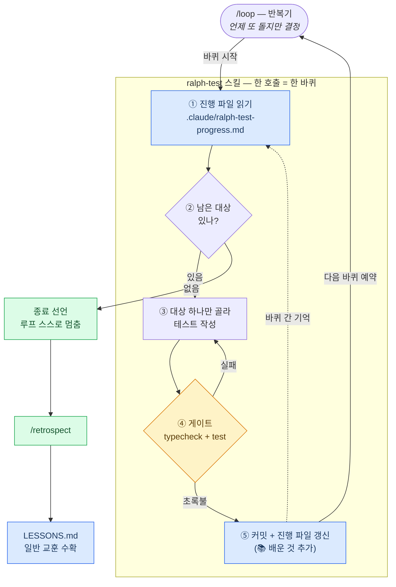

# 3주차 — 루프 엔지니어링

> 이 문서는 **"일이 사람 없이도 계속 돌게 만드는 법"** 을 다룬다.
> 2주차([`context.md`](./context.md))가 *Claude 가 무엇을 보는가*였다면, 3주차는 *Claude 가 어떻게 반복하는가*다.
> 루프 전체의 시각 지도(3레인·진단·변경 이력)는 [`dev-loop-map.html`](./dev-loop-map.html),
> push 게이트의 채점표는 [`eval-rubric.md`](./eval-rubric.md)를 본다.

## 도식 — 루프 한 바퀴는 어떻게 도는가

이번 주에 실제로 완주한 루프(`/loop /ralph-test`)를 그대로 그렸다.
핵심은 **반복하는 쪽(`/loop`)과 한 바퀴를 도는 쪽(스킬)이 분리**되어 있다는 것이다.

**실측 결과 (2026-07-14)**: 이 구조로 7바퀴가 사람 개입 없이 연속으로 돌아
대상 9건을 전부 소진했다 — 테스트 91개, 헛바퀴 0, 게이트가 잡은 오류 1(4바퀴 typecheck).

---

## 한눈에 — 루프를 이루는 부품

루프는 스킬 하나가 아니라 **부품 다섯 종류의 조합**이다. 각각이 다른 질문에 답한다.

| 부품 | 답하는 질문 | 이번 주에 만든 것 |
|---|---|---|
| 한 바퀴 스킬 | 한 번에 *무엇*을 하나 | `ralph-test` (모듈 1개 테스트) |
| 반복기 | *언제 또* 도나 | `/loop` (고정 간격 또는 자율 페이스) |
| 기억 | 지난 바퀴에서 *뭘 배웠나* | 진행 파일 📚 · `LESSONS.md` + `/retrospect` |
| 게이트 | 빨라져도 *안 망가지나* | `/commit` 검증 · `/ship`+`npm run eval` · CI · 계약 승인 |
| 지도 | 루프가 *어떻게 생겼나* | `dev-loop-map.html` + `loop-map-context` 훅 |

---

## 1. 한 바퀴 스킬 — "한 호출 = 한 바퀴"

`ralph-test` 는 호출 한 번에 **모듈 하나**만 처리한다: 진행 파일 읽기 → 종료 판정 →
하나 고르기 → 테스트 작성 → 게이트 통과 → 커밋+기록. 여러 개가 쉬워 보여도 하나만 한다.

왜 이렇게 잘게 나눴나. 랄프 루프의 전제는 **"매 바퀴는 이전 바퀴의 대화를 기억하지 못할 수 있다"** 이다.
긴 세션은 컨텍스트가 요약되며 세부를 잃는다. 그래서 바퀴를 작게 만들고,
"어디까지 했는가"를 머리가 아니라 **진행 상태 파일**(`.claude/ralph-test-progress.md`)에만 의존한다.

> **파일이 진실이다.** 바퀴 시작마다 진행 파일을 `tests/` 실제 파일과 대조해
> 어긋나 있으면 파일 기준으로 바로잡는다. 대화 기억은 믿지 않는다.

또 하나 — **종료 판정을 맨 앞에** 둔다. 남은 대상이 없으면 새 일을 만들어내지 않고
스스로 멈춤을 선언한다. 루프가 "일이 없는데도 도는" 폭주를 스킬 쪽에서 막는 안전장치다.

## 2. 반복기 — 반복은 스킬이 아니라 `/loop` 가 담당한다

스킬 안에 "다 될 때까지 반복하라"를 넣지 않았다. 반복은 `/loop /ralph-test` 가 맡는다.

| 모드 | 언제 다시 도나 | 쓰임 |
|---|---|---|
| 고정 간격 (`/loop 5m …`) | N분마다 | 주기 점검(배포 감시 등) |
| 자율 페이스 (`/loop …`) | 모델이 매 바퀴 끝에 "다음 바퀴가 의미 있나"를 판단해 직접 예약 | ralph-test 완주에 사용 |

이 분업의 이점: 한 바퀴 스킬은 **혼자 불러도 정확히 한 바퀴**만 돌아 테스트하기 쉽고,
반복 정책(간격·종료)은 루프 쪽에서 갈아 끼울 수 있다. 종료도 자연스럽다 —
스킬이 "남은 대상 없음"을 선언하면 루프가 예약을 멈추면 된다.

## 3. 기억 — 루프는 배운 것을 두 층에 남긴다

기록하지 않은 배움은 다음 바퀴가 같은 시행착오로 다시 산다. 층이 둘인 이유는 **수명이 다르기 때문**이다.

| 층 | 파일 | 담는 것 | 예 |
|---|---|---|---|
| 루프 전용 | 진행 파일의 📚 절 | 이 루프의 다음 바퀴만 바꾸는 지식 | "시간 의존 함수는 `vi.setSystemTime` 으로 고정" |
| 세션 일반 | `LESSONS.md` (`/retrospect` 가 수확) | 모든 루프·세션의 행동을 바꾸는 지식 | "zsh 에서 `status` 는 읽기 전용 예약 변수" |

둘 다 **적는 기준이 같다**: "다음 바퀴(세션)의 행동을 바꾸는가." 다짐·상식은 안 적는다.
세션당 최대 5줄 — 채우기용 기록은 읽는 비용만 늘린다. 항상 필요해진 교훈은 `CLAUDE.md` 로 승격하고 여기선 지운다.
(2주차의 컨텍스트 예산 원칙이 기억에도 그대로 적용된 것이다.)

## 4. 게이트 — 루프가 빨라질수록 게이트가 필요하다

사람이 매 단계를 보지 않으니, **품질은 절차에 내장**되어야 한다. 선의("잘 확인하자")가 아니라 의무로.

| 게이트 | 어디서 | 무엇을 막나 |
|---|---|---|
| 커밋 게이트 | `/commit` — `typecheck`+`test` 초록불 없이 커밋 금지 | 깨진 코드가 이력에 들어가는 것 (문서-only 만 예외) |
| push 게이트 | `/ship` — `npm run eval` rubric 11항목 **100/100 일 때만** push | 동작 안 하는 서비스가 원격에 가는 것 |
| 원격 검문소 | CI (`.github/workflows/ci.yml`) — push·PR 마다 재검증 | 로컬 환경 특수성에 기댄 통과 |
| 계약 승인 | `/orchestrate` — 계약(OS.md 12장) 변경 시에만 Draft PR 로 사람이 선승인 | 방향이 틀린 채 구현까지 가는 것 |

핵심 문장은 **"push 는 사람이 아니라 평가가 허가한다"** (2026-07-14 결정).
사람의 승인을 없앤 게 아니라 **가장 싼 지점으로 옮겼다** — 방향이 갈리는 계약 변경은
구현 *전*에(고치기 가장 쌈), 기계가 판정할 수 있는 push 는 평가에 이양.

실제로 게이트가 일을 했다: ralph-test 4바퀴에서 typecheck 게이트가 오류 1건을 커밋 전에 잡았고,
`/ship` 첫 실행에서는 평가 스크립트 자신의 함정("필터 결과 0건이어도 통과")을 발견해 강화했다.
**게이트도 루프를 돌며 함께 진화한다.**

## 5. 지도 — 루프 자체를 관측 대상으로

루프를 굴리는 것과 별개로, **루프가 어떻게 생겼는지**를 [`dev-loop-map.html`](./dev-loop-map.html)에
사람·AI·CI 3레인 9단계로 그리고 병목·반복·낭비를 진단했다. 최초 진단 6건 중 5건이 이번 주에 해소됐다.

| 진단 | 내용 | 결과 |
|---|---|---|
| 낭비 ① | push 뒤 아무도 재검증 안 함 | ✅ CI 신설 |
| 낭비 ② | 커밋이 검증 없이 됨 | ✅ `/commit` 게이트 |
| 반복 ① | 시행착오가 세션 간 증발 | ✅ `/retrospect`+`LESSONS.md` |
| 반복 ② | 매 세션 컨텍스트 재로딩 | ✅ 훅 자동 주입 (2주차) |
| 병목 ① | 사람이 유일한 직렬 구간 | ✅ push 부분 해소 (`/ship`), 확인·승인은 의도적 유지 |
| 병목 ② | 사람인 API 외부 승인 | ⛔ 루프 개선으로 못 푸는 유일한 병목 |

지도가 낡지 않게 하는 장치가 `loop-map-context` 훅이다: 루프 구성 파일(훅·스킬·settings·CI)이
수정되면 "지도를 갱신·재발행하라"는 컨텍스트를 자동 주입한다. **감지는 기계가, 의미 해석은 모델이** 맡는 분업 —
2주차 `decision-log` 훅과 같은 패턴이다.

---

## 설계 원칙 4가지

이번 주에 반복해서 부딪히며 굳어진 것들이다. 새 루프를 만들 때 지킨다.

### 1. 한 바퀴는 작게, 반복은 밖에서

스킬은 "한 호출 = 한 바퀴"만 책임지고, 반복·종료 정책은 `/loop` 가 맡는다.
바퀴가 작아야 실패해도 한 바퀴만 버리면 되고, 혼자 불러 테스트할 수 있다.

### 2. 기억은 머리가 아니라 파일에

바퀴 간 대화 기억을 전제하지 않는다. 진행 상태는 진행 파일이, 교훈은 📚/`LESSONS.md` 가 진실이다.
그리고 기억에도 예산이 있다 — "행동을 바꾸는 지식"만 적고, 항상 필요한 건 승격하고, 겹치면 보강한다.

### 3. 품질은 선의가 아니라 게이트로

"초록불 없이 커밋 금지"가 ralph-test 안에만 있던 시절, 일반 작업은 검증 없이 커밋됐다.
규칙은 문서에 적는 것(부탁)이 아니라 절차에 내장하는 것(보장)이다 — 2주차 "부탁 vs 보장"의 루프판.

### 4. 루프는 스스로 멈춘다

종료 판정을 바퀴 맨 앞에 두고, 끝나면 새 일을 만들지 않고 멈춤을 선언한다.
멈춤은 실패가 아니라 루프의 정상 종료다. 멈춘 직후가 `/retrospect` 의 자리다 —
수확은 루프가 끝났을 때 가장 싸다.

---

## 알아두면 덜 헤매는 것

- **루프를 시작하기 전에 `LESSONS.md` 를 훑는다.** 지난 루프가 산 시행착오를 다시 사는 게 최대 낭비다.
- **진행 파일과 실제 산출물이 어긋날 수 있다** (사람이 파일을 지웠거나 이전 바퀴가 중단됐거나).
  그래서 매 바퀴 첫 단계가 "대조 후 파일 기준으로 바로잡기"다.
- **평가 서버는 3100 포트로 분리**되어 있어 `npm run dev`(3000)와 동시에 돌 수 있다.
  90초 안에 안 뜨면 `dev.db`·`node_modules` 부재부터 의심(CLAUDE.md 실행 명령 참조).
- **`gh` 인증이 죽어도(401) 공개 저장소 CI 는 무인증 REST API 로 조회 가능** —
  `api.github.com/repos/<owner>/<repo>/actions/runs`. 재로그인을 기다릴 필요 없다.

---

## 함께 보기

- [`dev-loop-map.html`](./dev-loop-map.html) — 루프 지도 원본 (3레인 9단계·진단·변경 이력)
- [`eval-rubric.md`](./eval-rubric.md) — push 게이트 채점표 (rubric 11항목)
- [`context.md`](./context.md) — 2주차: 컨텍스트 설계 (훅·주입·설계 원칙)
- [`../LESSONS.md`](../LESSONS.md) — 세션 교훈 누적처 (`/retrospect` 가 쌓는다)
- [`../.claude/skills/ralph-test/SKILL.md`](../.claude/skills/ralph-test/SKILL.md) — 한 바퀴 스킬의 실제 절차
- [`../.claude/skills/ship/SKILL.md`](../.claude/skills/ship/SKILL.md) — push 게이트의 실제 절차
